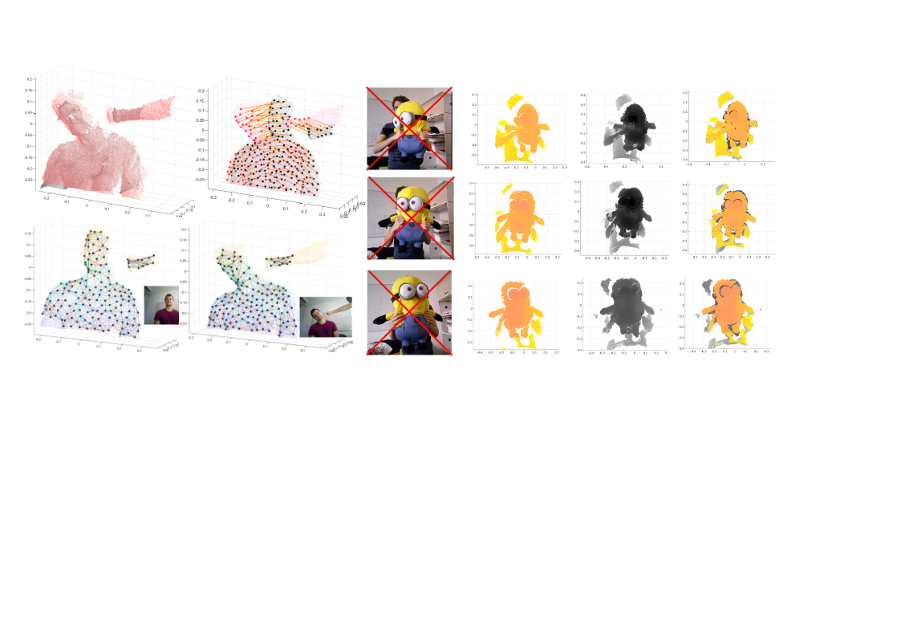
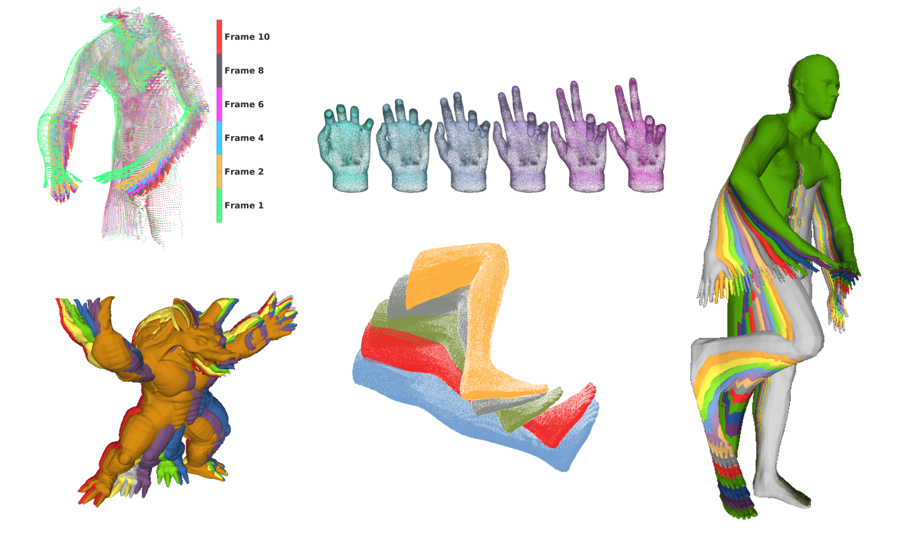

## SPaM: Soft Patch Matching for Non-rigid Pointcloud Registration

We propose a novel non-rigid registration framework for raw, unstructured, subject-to-deformation pointclouds purely based on geometric features. 
While non-rigid registration approaches often rely on visual information or pre-defined shape templates, our framework simply consists of clusters of points with soft boundaries so-called soft patches. We use SHOT descriptors to establish an initial correspondence graph over the source and target soft patches. The key feature of the proposed framework is our novel strategy to search through this graph based on the rigidity terms defined in a reformulation of As-Rigid-As-Possible as the assignment error. The non-rigid registration problem is then formulated as an aggregation of weighted locally rigid transformations, with the locality embodied in the soft patches. Given the optimized graph and the weighted transformations, individual points from the source are warped to the target. We evaluate and benchmark the proposed framework with state-of-art algorithms in simulated and real datasets. Experiments demonstrate the capability of the proposed approach to cope with large deformations and missing data.

### Datasets
Due to the lack of a publicly available datasets with ground truth, we synthetically generated deforming pointclouds to benchmark our approach. These datasets are publicly available online [***HERE***](https://studentutsedu-my.sharepoint.com/:f:/g/personal/behnam_maleki_uts_edu_au/EqJdAmXs43dIsZsxkBQ_mLgB7YRJ67Hz90eLUKoCJwOOWQ?e=ZZbmKF). These models are exported as ".ply" format and the indicies in these deformable models are preserved so that they can be traced within different deformations. Therefore, the points with similar indices are correspodning to each other throughout the deformations.

### Video


